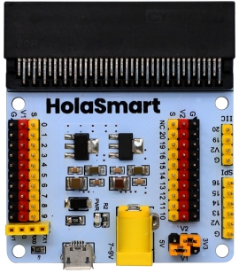
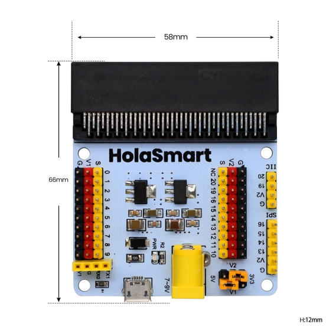
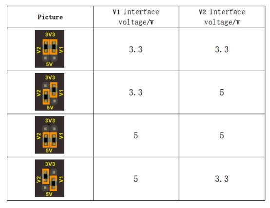
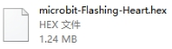
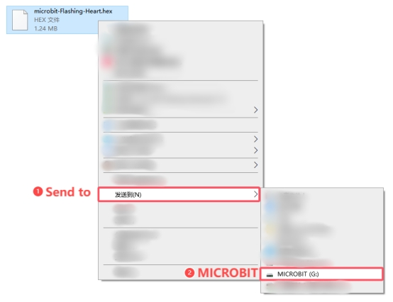
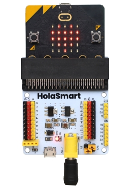
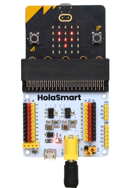

# HolaSmart micro bit Sensor V1 Expansion Board

## 1. Board Description

### 1.1 Description

In the educational market, micro:bit control boards are becoming more and more popular. However, a single micro:bit control board is not easy to test with other sensor modules. We particularly design this sensor expansion board for micro:bit. 

The sensor shield breaks out all the PIO ports on the micro:bit control board into 3PIN interface (GND, VCC, Signal), very easy to connect the micro:bit control board and other sensor modules. 

Moreover, it also extends some commonly-used serial communication interfaces into pin or female headers with 2.54mm pin pitch, such as I2C and SPI communication pins. So that this shield will allow communication between micro:bit control board and other communication devices. 

You can power the micro:bit board through a yellow DC jack (DC 7-9V) or a mciro USB port (DC 5V) on the shield. 

When power the sensor, you could select the supply voltage 3.3V or 5V via jumper cap V1 and V2.

**Special note:**

when connect external sensor module to the shield for working,the operating current of AMS1117-3.3V and NCP1117ST50T3G chip is too large, so it is easy to get hot. Pay special attention to avoid touching the two chips and causing burns.

---

### 1.2 Controller Compatible

micro:bit control board

---

### 1.3 Technical Details

- Power input: yellow DC (DC7-9V) or micro USB port(DC5V)
- Voltage output: select 3.3V or 5V via jumper cap V1/V2
- Comes with a power indicator
- Extends the PIO of micro:bit into 3PIN interface
- Serial communication pin
- I2C communication pin
- SPI communication pin
- Dimensions: 65mm x58mm x12mm
- Weight: 31g

---

### 1.4 PINOUT Diagram

---

## 2. Example Use

1、Insert the microbit board into the V1 expansion board and connect them to your computer via USB cable.

2、Upload code to the microbit.

Find the code file  in our folder, and choose to send to MICROBIT(G:),

 

3、After uploading the code, you will see a beating heart!

 

